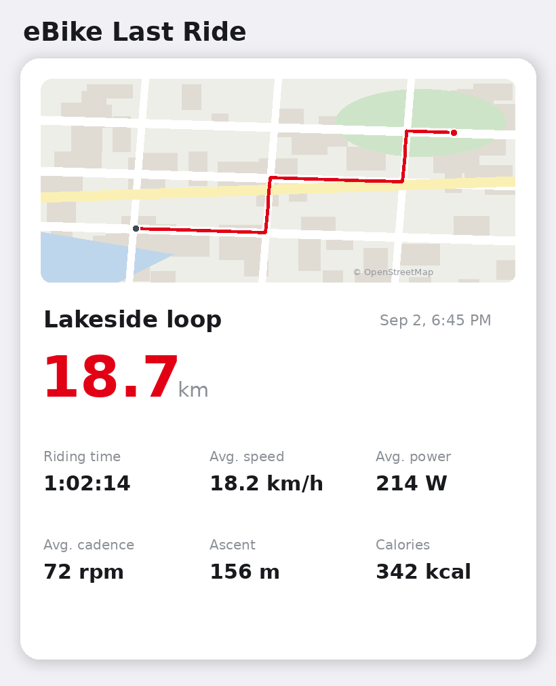
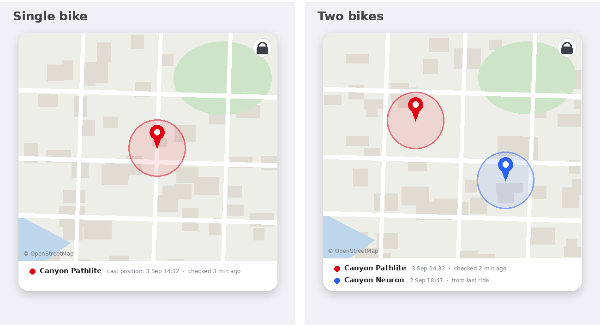

# Bosch eBike Smart System — Homey Pro App


A [Homey Pro](https://homey.app) app to monitor your **Bosch Smart System eBike** — battery, range, motor stats, per-mode riding statistics, and full hardware details — all inside Homey.

-----

## ⚠️ Important Disclaimer
> 
> This integration requires:
>
> - **ConnectModule** hardware installed on your bike (sold separately, ~€100-150)
> - **Bosch eBike Flow+** subscription (~€30-50/year)
> - **Bosch eBike Flow** app (Gen 4 and up)
>
> **This will NOT work with older Bosch eBike Connect app (Gen 3 and below).**
> 
> **This app is not officially supported, endorsed, or affiliated with Bosch eBike Systems in any way.**
> 
> The Bosch Smart System does not currently offer a public API for third-party integrations. This app works by using the same private API used by the official **Bosch Flow / One Bike App** (also known as One Bike App). This approach was reverse-engineered by the community and is used here as a workaround until an official API becomes available.
> 
> **What this means for you:**
> 
> - Bosch may change or disable this API at any time without notice, which could break the app
> - Your Bosch account credentials are used only for authentication — no data is stored outside of your Homey
> - Use at your own risk
> 
> If Bosch ever releases an official public API, this app will be updated to use it.

-----

## Features

- Battery state of charge (%) and remaining energy (Wh)
- Estimated range in all assist modes (Eco / Tour / eMTB / Sport / Turbo)
- Odometer, motor hours, and charge cycle tracking
- Per-assist-mode distance and energy consumption
- Charging status indicator
- **Bike photo** displayed on the device tile (from Bosch CDN)
- **Full hardware info** in Advanced Settings — battery, motor, connect module, remote, head unit (model, serial, firmware, manufacturing date)
- **Last known location** on the device and on a dashboard **map widget** (ConnectModule with eBike Alarm; other bikes are located from their last ride)
- **Last Ride widget** — GPS track, distance, riding time, avg. speed, avg. power, cadence, ascent and calories
- **Theft/movement Flow cards** — get alerted when the bike moves while idle, with map link tags
- **Adaptive location polling** — every 5 minutes normally, every minute while a possible theft is in progress
- Automatic status polling every 5 minutes; ride history every 30 minutes
- Supports multiple bikes on one account (color-coded on the map)
- Re-authenticate without removing the device

-----

## Requirements

- Homey Pro (Early 2023) or newer — firmware v12.3+ (required for widgets)
- For location and theft alerts: a **ConnectModule** registered for the **eBike Alarm** feature
- A Bosch Smart System eBike registered in the **Bosch Flow / One Bike App**
- A **desktop computer or laptop** with Chrome or Firefox (required for the one-time login step — a mobile browser will not work)
- Your Bosch account login credentials

-----

## Widgets Preview

*Illustrative previews (example data and locations):*


*The Last Ride widget: GPS track, distance and ride statistics*


*The Location widget — last known position with accuracy circle and pan/zoom lock; with multiple bikes, each gets its own color for pin, circle and footer*

-----

## Adding Your Bike — Step by Step

Because Bosch does not offer a public API, authentication requires a **one-time manual step** through a desktop browser. This is a workaround to obtain the authorization token that Homey needs to communicate with the Bosch cloud on your behalf.

> ⚠️ **This step cannot be completed on a mobile phone.** You need a desktop or laptop browser with Developer Tools (Chrome or Firefox). This is a known limitation of the workaround approach.

You only need to do this once per Homey installation, or when your session expires (which is rare with the `offline_access` token scope).

-----

### Step 1 — Generate your Login URL

The app generates a unique, secure login URL for your Bosch account using PKCE (a secure OAuth2 method). You need to copy this URL to your desktop browser.

1. Open the **Homey** app on your phone
1. Go to **More → Apps → Bosch eBike → Settings**


1. You will see the **Setup** tab with a generated **Login URL**
1. Tap **Copy** to copy the URL to your clipboard


-----

### Step 2 — Sign in and capture the authorization code

This is the trickiest step. Because the Bosch login redirects to a mobile deep link (`onebikeapp-ios://`) that desktop browsers cannot open, you need to intercept the redirect using Developer Tools.

1. On your **desktop computer**, open **Chrome** or **Firefox**
1. Open **Developer Tools**:
- **Chrome**: press `F12`, or right-click anywhere → **Inspect**
- **Firefox**: press `F12`
1. Click the **Network** tab in Developer Tools
1. Make sure recording is active (red dot in Chrome, or pause button not active in Firefox)


1. Paste the Login URL into the browser address bar and press **Enter**
1. The Bosch account login page will appear — sign in with your Bosch / One Bike App email and password


1. After a successful login, the browser will **attempt to open** a link starting with `onebikeapp-ios://` — this will fail with an error in the browser, which is **completely normal and expected**
1. In the **Network tab**, look for a request that starts with `onebikeapp-ios://` — it will appear in the list. Click on it.


1. The full URL in the request will look like this:
   
   ```
   onebikeapp-ios://com.bosch.ebike.onebikeapp/oauth2redirect?code=XXXXXXXXXXXXXXXX&state=...
   ```
1. Copy the value after `code=` and before the next `&` — that is your **authorization code**


> 💡 **Tip:** The code is a long string of random characters. Copy only the code itself, not the `code=` prefix or anything after the `&`.

-----

### Step 3 — Add your bike in Homey

1. Open the **Homey** app on your phone
1. Go to **Devices → +** → search for **Bosch eBike** → tap it


1. On the pairing screen you will see a reminder of the instructions
1. In the **Authorization Code** field, paste the code you copied in Step 3


1. Tap **Next** — Homey will connect to Bosch and retrieve your registered bike(s)
1. Select the bike(s) you want to add and tap **Add**


Your bike will now appear as a device in Homey. The bike photo and all data will appear within 5 minutes on the first poll.

-----

## Re-Authentication

Tokens use `offline_access` scope and last a long time. However if your bike stops updating, re-authentication is needed.

**Option A — Via Advanced Settings (quickest, no re-pairing needed):**

1. Follow Steps 2–3 above to get a new authorization code
1. Open the device → **Settings → Advanced Settings → Connection**
1. Paste the new code into the **Authorization Code** field
1. Tap **Save**


**Option B — Via Repair (full re-pairing):**

1. Long-press the device tile → **⋮** → **Repair**
1. Follow the full pairing flow (Steps 2–4)
1. The device stays in place — only the tokens are updated

-----

## Capabilities

### Battery

|Capability            |Description                                      |
|----------------------|-------------------------------------------------|
|Battery (%)           |State of charge                                  |
|Charging              |Whether the battery is currently charging        |
|Remaining Energy      |Remaining energy in Wh                           |
|Battery Capacity      |Total capacity in Wh                             |
|Charge Cycles         |Total charge cycles (on-bike + off-bike combined)|
|Charge Cycles On Bike |Charge cycles done with battery installed        |
|Charge Cycles Off Bike|Charge cycles done with battery removed          |
|Lifetime Energy       |Total Wh consumed over the battery’s lifetime    |

### Range Estimates

|Capability |Assist Mode|
|-----------|-----------|
|Range Eco  |Eco        |
|Range Tour |Tour / eMTB|
|Range Sport|Sport      |
|Range Turbo|Turbo      |

### Odometer & Motor

|Capability          |Description                           |
|--------------------|--------------------------------------|
|Odometer            |Total distance ridden (km)            |
|Motor Hours         |Total motor operating hours           |
|Motor Hours (Assist)|Hours the motor was actively assisting|
|Max Assist Speed    |Speed limit for motor assist (km/h)   |

### Per-Mode Distance & Energy

Cumulative distance and energy consumption per assist mode: **Off / Eco / Tour / Sport / Turbo**

-----

## Advanced Settings

Open device → **Settings → Advanced Settings** to see:

**Connection** — paste a new Authorization Code to re-authenticate

**Bike** — Brand, Category, Frame ID, Gearing system

**Battery** — Model, Serial, Firmware, Hardware, Part Number, Manufacturing Date

**Motor** — Model, Product Line, Serial, Firmware, Hardware, Part Number, Manufacturing Date

**Connect Module** — Model, Serial, Firmware, Manufacturing Date

**Remote / Controller** — Model, Serial, Firmware, Manufacturing Date

**Head Unit** *(if fitted)* — Model, Serial, Firmware, Manufacturing Date

All fields populate automatically on the first poll.

-----

## Flows

**Custom trigger cards:**

- eBike charging started / stopped
- eBike battery drops below X% *(fires once when crossing the threshold)*
- eBike battery rises above X% *(e.g. switch the charger plug off at 80%)*
- eBike location changed (possible alarm) *(new position while the bike is idle — not charging, not being ridden; tip: enable Bosch eBike Lock so a thief cannot simply ride away)*
- eBike location updated *(every position report, unfiltered — combine with your own conditions, e.g. "and I am not home")*
- A new ride was recorded *(with distance / duration / avg. speed / calorie tags)*

**Example flows:**

- *WHEN battery rises above 80% → turn off the charger wall plug*
- *WHEN possible alarm → AND I am home → flash the lights and send a notification with the map link*
- *WHEN new ride recorded → send "Nice ride! {distance} km at {avg speed} km/h"*

**Custom condition cards:**

- eBike is / is not charging
- eBike battery is above / below X%

All numeric capabilities also automatically generate “becomes greater/less than” flow cards.

-----

## Dashboard Widgets

**eBike Location** — framed map with a colored pin and accuracy circle per bike, a footer showing when each position was last reported and last checked, and a lock button (tap to enable pan/zoom, tap again so the dashboard scrolls normally). Select one, several or all bikes when adding the widget. Bikes without a ConnectModule show the end point of their last ride ("from last ride").

**eBike Last Ride** — your latest ride with its GPS track (toggleable in the widget settings), the distance as a headline, and riding time, avg. speed, avg. power, avg. cadence, ascent and calories. One widget per bike — pick the bike when adding it.

Widgets require Homey Pro (Early 2023) or newer. Ride data appears after it syncs to the Bosch cloud (checked every 30 minutes).

-----

## App Settings & Debug

Open **More → Apps → Bosch eBike → Settings**:

**Setup tab** — login URL generator with Copy button and step-by-step instructions

**Debug tab** — live log of the last API poll per bike. Use **Refresh** to reload and **Clear** to reset.

-----

## Known Limitations

- **Unofficial API** — Bosch may change or disable access at any time. This is the fundamental limitation of this approach.
- **Polling, not push** — status is checked every 5 minutes (location every minute during a suspected theft). The official Flow app's push notifications will always be faster; treat the alarm cards as an automation layer next to them, not a replacement.
- **Sporadic location reports** — the ConnectModule only reports its position when the bike is powered on, charging, or its motion alarm fires, so the "last known location" can be hours old.
- **Desktop browser required** for initial authentication — the authorization code cannot be captured on mobile
- **One Bike App must be set up** — your bike must already be registered in the official Bosch Flow / One Bike App before pairing with Homey

-----

## Changelog

See [CHANGELOG.md](CHANGELOG.md).

-----

## Project Structure

```
com.bosch.ebike/
├── app.js                          # App entry point, debug logging
├── app.json                        # Generated manifest (do not edit directly)
├── package.json
├── .homeycompose/
│   ├── app.json                    # App manifest source (edit this)
│   ├── capabilities/               # One JSON file per custom capability
│   └── flow/                       # Flow triggers and conditions
├── settings/
│   └── index.html                  # App settings UI (Setup + Debug tabs)
├── assets/
│   ├── icon.svg
│   ├── images/                     # App store icons
│   └── capabilities/               # SVG icon per capability
├── lib/
│   ├── BoschEBikeApi.js            # API client, PKCE, token exchange, parsing
│   └── constants.js                # Capability name constants
├── widgets/
│   ├── bike-location/              # Location map widget (api.js + public/)
│   └── last-ride/                  # Last ride widget (api.js + public/)
└── drivers/ebike/
    ├── driver.compose.json         # Driver manifest (Homey Compose)
    ├── driver.settings.compose.json # Advanced Settings definition
    ├── driver.js                   # Pairing, repair, token exchange
    └── device.js                   # Polling, capability updates, token refresh
```

-----

## Related Projects

- **[hass-bosch-ebike](https://github.com/Phil-Barker/hass-bosch-ebike)** by Phil Barker — Home Assistant integration for Bosch Smart System eBikes. The starting point that revealed the API endpoints, authentication flow, and data structure used in this app. If you use Home Assistant, check it out.

This app was designed and built in collaboration with **[Claude](https://claude.ai)** (Anthropic).

-----

## Contributing

Pull requests welcome. Especially:

- Testing with different battery models (PowerTube 400, 500, 625, 750)
- Testing with different motor generations (Performance Line, CX, Cargo Line)
- Translations

Please open an issue to discuss before submitting a pull request.

-----

## License

[MIT License](LICENSE) — free to use, copy, modify, distribute. No warranty provided.
